# Data Flow Documentation

This document describes the data flow and processing pipeline in CloudMon Metrics Processor, from raw TSDB metrics to health status indicators.

## Overview

The metrics-processor transforms data through three main stages:

```
Raw Metrics (TSDB) → Flag Metrics (Binary) → Health Metrics (Semaphore)
```

## Stage 1: TSDB to Flag Metrics

### Input: Raw Time-Series Data

Raw metrics are queried from Graphite TSDB in the following format:

```json
{
  "target": "stats.timers.api.production.mean",
  "datapoints": [
    [150.5, 1704067200],
    [175.2, 1704067260],
    [520.3, 1704067320],
    [null, 1704067380],
    [180.1, 1704067440]
  ]
}
```

Each datapoint is a tuple of `(value, unix_timestamp)`. Values may be `null` if no data was recorded.

### Configuration: Flag Metric Definition

Flag metrics are defined in configuration:

```yaml
metric_templates:
  api_latency:
    query: "stats.timers.api.$environment.$service.mean"
    op: gt                # greater than
    threshold: 500        # milliseconds

flag_metrics:
  - name: api_slow
    service: my_api
    template:
      name: api_latency
    environments:
      - name: production
      - name: staging
        threshold: 300    # override for staging
```

### Processing: Template Expansion

Templates are expanded using variable substitution:

```
Input:  stats.timers.api.$environment.$service.mean
Output: stats.timers.api.production.my_api.mean
```

**Code Location**: `src/types.rs` - `AppState::process_config()`

```rust
// Variable substitution using custom regex
let custom_regex = Regex::new(r"(?mi)\$([^\.]+)").unwrap();
let tmpl_query = Template::new(tmpl.query.clone()).with_regex(&custom_regex);
let vars: HashMap<&str, &str> = HashMap::from([
    ("service", metric_def.service.as_str()),
    ("environment", env.name.as_str()),
]);
raw.query = tmpl_query.render(&vars).unwrap();
```

### Processing: Flag Evaluation

Each raw metric value is compared against its threshold:


**Code Location**: `src/common.rs` - `get_metric_flag_state()`

```rust
pub fn get_metric_flag_state(value: &Option<f32>, metric: &FlagMetric) -> bool {
    return match *value {
        Some(x) => match metric.op {
            CmpType::Lt => x < metric.threshold,
            CmpType::Gt => x > metric.threshold,
            CmpType::Eq => x == metric.threshold,
        },
        None => false,  // No data = flag lowered
    };
}
```

### Output: Flag Metric Data

After evaluation, raw values become binary flags:

```json
{
  "target": "my_api.api_slow",
  "datapoints": [
    [0, 1704067200],   // 150.5 > 500? false → 0
    [0, 1704067260],   // 175.2 > 500? false → 0
    [1, 1704067320],   // 520.3 > 500? true  → 1
    [0, 1704067380],   // null → 0
    [0, 1704067440]    // 180.1 > 500? false → 0
  ]
}
```

## Stage 2: Flag Metrics to Health Metrics

### Input: Multiple Flag States

A service typically has multiple flag metrics. For each timestamp, we collect all flag states:

```
Timestamp: 1704067320
Flags:
  - my_api.api_slow:        true  (latency > 500ms)
  - my_api.error_rate:      false (errors < 1%)
  - my_api.availability:    true  (uptime < 99.9%)
```

### Configuration: Health Expression Definition

Health metrics combine flags using boolean expressions with weights:

```yaml
health_metrics:
  my_api:
    service: my_api
    component_name: "My API Service"
    category: compute
    metrics:
      - my_api.api_slow
      - my_api.error_rate
      - my_api.availability
    expressions:
      - expression: "my_api.api_slow"
        weight: 1  # Degraded (slow but working)
      - expression: "my_api.error_rate"
        weight: 1  # Degraded (some errors)
      - expression: "my_api.api_slow && my_api.error_rate"
        weight: 2  # Outage (slow AND errors)
      - expression: "!my_api.availability"
        weight: 2  # Outage (service down)
```

### Processing: Expression Context Building

For each timestamp, a context is built with all flag values:


**Code Location**: `src/common.rs` - `get_service_health()`

```rust
// Build context with all metrics
for metric in hm_config.metrics.iter() {
    let xval = match ts_val.get(metric) {
        Some(&x) => x,
        _ => false,  // Default if metric missing
    };
    context
        .set_value(metric.replace("-", "_").into(), Value::from(xval))
        .unwrap();
}
```

### Processing: Expression Evaluation

Each expression is evaluated against the context:


**Code Location**: `src/common.rs` - expression evaluation loop

```rust
let mut expression_res: u8 = 0;
// loop over all expressions
for expr in hm_config.expressions.iter() {
    // if expression weight is lower then what we have already - skip
    if expr.weight as u8 <= expression_res {
        continue;
    }
    match eval_boolean_with_context(expr.expression.as_str(), &context) {
        Ok(m) => {
            if m {
                expression_res = expr.weight as u8;
                tracing::debug!(
                    "Expression matched: {:?}, weight: {:?}",
                    expr.expression,
                    expr.weight
                );
            }
        }
        Err(e) => {
            return Err(CloudMonError::ExpressionError);
        }
    }
}
```

### Output: Health Status

The final health status is the maximum weight of all matching expressions:

| Value | Status | Meaning |
|-------|--------|---------|
| 0 | 🟢 Green | Service healthy (no expressions matched) |
| 1 | 🟡 Yellow | Service degraded |
| 2 | 🔴 Red | Service outage |

```json
{
  "name": "my_api",
  "service_category": "compute",
  "environment": "production",
  "metrics": [
    [1704067200, 0],  // Green
    [1704067260, 0],  // Green
    [1704067320, 1],  // Yellow (api_slow matched)
    [1704067380, 0],  // Green
    [1704067440, 0]   // Green
  ]
}
```

## Stage 3: Health to Dashboard Notification

### Input: Health Status from Convertor

The Reporter polls the Convertor API:

```http
GET /api/v1/health?environment=production&service=my_api&from=-5min&to=-2min
```

### Processing: Status Detection

The Reporter checks the latest health value:


**Code Location**: `src/bin/reporter.rs` - metric_watcher loop

```rust
// Peek at last metric in the vector
if let Some(last) = data.metrics.pop() {
    // Is metric showing issues?
    if last.1 > 0 {
        tracing::info!("Bad status found: {}", last.1);
        // Build and send notification...
    }
}
```

### Output: Dashboard Update

```http
POST /v1/component_status
Authorization: Bearer <jwt_token>
Content-Type: application/json

{
  "name": "My API Service",
  "impact": 1,
  "attributes": [
    {"name": "region", "value": "us-east-1"},
    {"name": "tier", "value": "production"}
  ]
}
```

## Complete Flow Sequence Diagram


## Example: Complete Metric Evaluation

### Input Configuration

```yaml
datasource:
  url: "http://graphite.example.com"

environments:
  - name: production
    attributes:
      region: us-east-1

metric_templates:
  latency_high:
    query: "stats.timers.$service.$environment.p99"
    op: gt
    threshold: 1000

flag_metrics:
  - name: slow_response
    service: checkout
    template:
      name: latency_high
    environments:
      - name: production

health_metrics:
  checkout:
    service: checkout
    component_name: "Checkout Service"
    category: ecommerce
    metrics:
      - checkout.slow_response
    expressions:
      - expression: "checkout.slow_response"
        weight: 1
```

### Step 1: Template Expansion

```
Template: stats.timers.$service.$environment.p99
Variables: service=checkout, environment=production
Result:   stats.timers.checkout.production.p99
```

### Step 2: TSDB Query

```http
GET /render?target=alias(stats.timers.checkout.production.p99,'checkout.slow_response')&from=-10min&until=-5min&format=json&maxDataPoints=100
```

### Step 3: Raw Response

```json
[
  {
    "target": "checkout.slow_response",
    "datapoints": [
      [850.5, 1704067200],
      [920.3, 1704067260],
      [1250.7, 1704067320],
      [980.1, 1704067380]
    ]
  }
]
```

### Step 4: Flag Evaluation

| Timestamp | Raw Value | Operation | Threshold | Flag |
|-----------|-----------|-----------|-----------|------|
| 1704067200 | 850.5 | > | 1000 | false |
| 1704067260 | 920.3 | > | 1000 | false |
| 1704067320 | 1250.7 | > | 1000 | **true** |
| 1704067380 | 980.1 | > | 1000 | false |

### Step 5: Health Calculation

| Timestamp | Context | Expression | Result | Weight | Final |
|-----------|---------|------------|--------|--------|-------|
| 1704067200 | slow_response=false | slow_response | false | - | 0 🟢 |
| 1704067260 | slow_response=false | slow_response | false | - | 0 🟢 |
| 1704067320 | slow_response=true | slow_response | **true** | 1 | 1 🟡 |
| 1704067380 | slow_response=false | slow_response | false | - | 0 🟢 |

### Step 6: API Response

```json
{
  "name": "checkout",
  "service_category": "ecommerce",
  "environment": "production",
  "metrics": [
    [1704067200, 0],
    [1704067260, 0],
    [1704067320, 1],
    [1704067380, 0]
  ]
}
```

### Step 7: Reporter Notification

Reporter polls with `from=-5min&to=-2min`, receives the response, and if the last datapoint shows status > 0:

```json
POST /v1/component_status
{
  "name": "Checkout Service",
  "impact": 1,
  "attributes": [
    {"name": "region", "value": "us-east-1"}
  ]
}
```

## Data Transformation Summary

```mermaid
graph TB
    subgraph Input["Input (Graphite)"]
        Raw["Raw Metric<br/>850.5 ms"]
    end
    
    subgraph Stage1["Stage 1: Flag Evaluation"]
        Compare["Compare<br/>850.5 > 1000?"]
        Flag["Flag<br/>false"]
    end
    
    subgraph Stage2["Stage 2: Health Calculation"]
        Context["Context<br/>slow_response=false"]
        Expr["Expression<br/>slow_response"]
        Weight["Weight<br/>0 (no match)"]
    end
    
    subgraph Output["Output (API)"]
        Health["Health<br/>0 🟢"]
    end
    
    Raw --> Compare
    Compare --> Flag
    Flag --> Context
    Context --> Expr
    Expr --> Weight
    Weight --> Health
    
    style Input fill:#e3f2fd
    style Stage1 fill:#fff3e0
    style Stage2 fill:#e8f5e9
    style Output fill:#fce4ec
```



## Key Data Structures

### MetricPoints (Flag Data)

```rust
pub type MetricPoints = BTreeMap<u32, bool>;
// { timestamp -> flag_state }
// { 1704067320 -> true, 1704067380 -> false }
```

### ServiceHealthData

```rust
pub type ServiceHealthData = Vec<(u32, u8)>;
// [(timestamp, health_value), ...]
// [(1704067320, 1), (1704067380, 0)]
```

### Internal Metrics Map

```rust
// During health calculation, data is reorganized by timestamp:
let mut metrics_map: BTreeMap<u32, HashMap<String, bool>> = BTreeMap::new();
// {
//   1704067320: {
//     "checkout.slow_response": true,
//     "checkout.error_rate": false
//   }
// }
```

## Related Documentation

- [Architecture Overview](overview.md): Component descriptions
- [Architecture Diagrams](diagrams.md): Visual representations
- [Configuration Reference](../configuration/overview.md): Config options
- [API Reference](../api/endpoints.md): Endpoint documentation
