# Architecture Diagrams

This document contains visual representations of the CloudMon Metrics Processor architecture using Mermaid diagrams.

## System Architecture

### High-Level Component Diagram

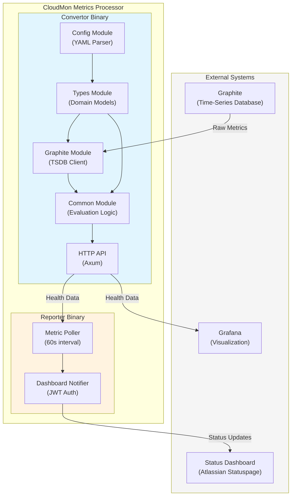

### Component Interactions

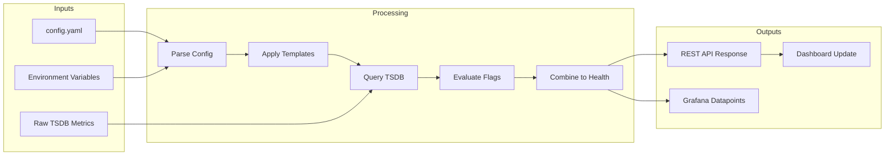

## Module Dependency Graph

### Library Crate Dependencies

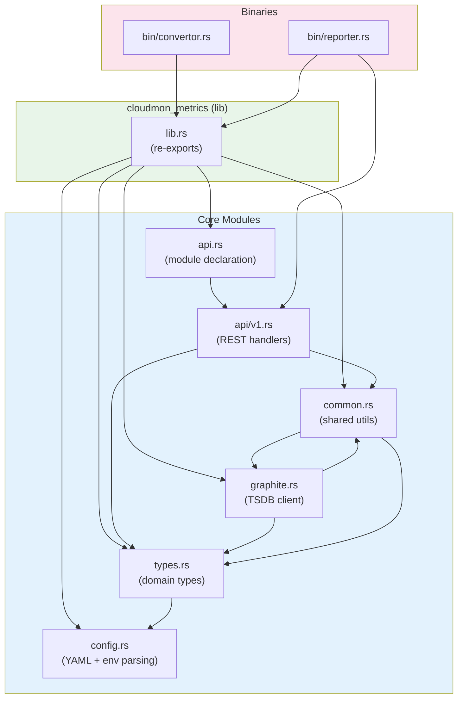

### External Crate Dependencies

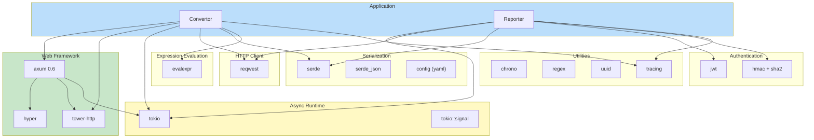

## Deployment Architecture

### Standalone Deployment

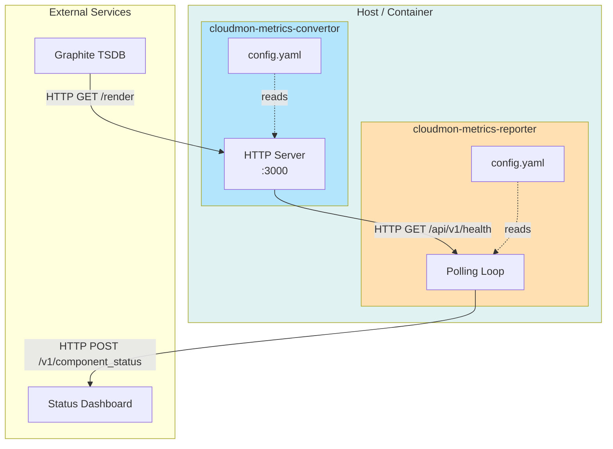

### Kubernetes Deployment

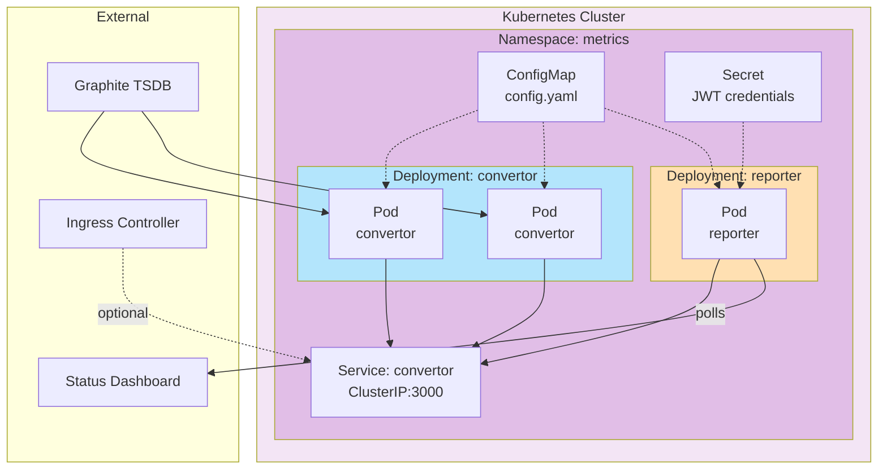

### High Availability Setup

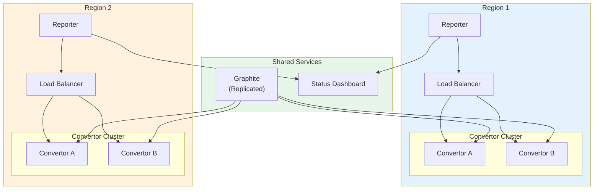

## Request Flow Diagrams

### Health API Request Flow

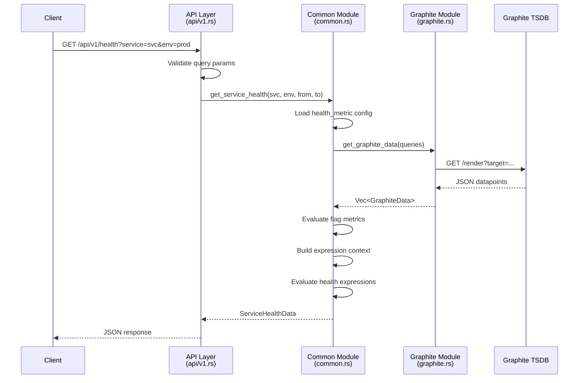

### Reporter Notification Flow

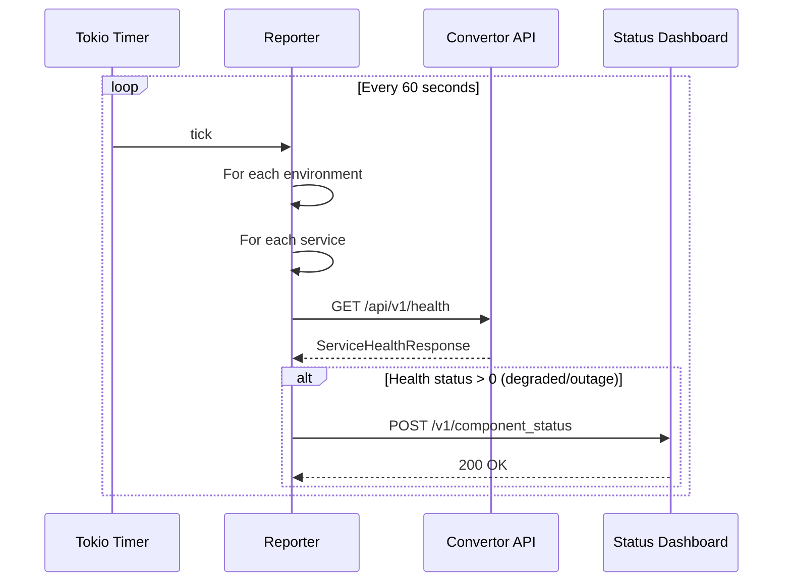

## Data Structure Diagrams

### Configuration Hierarchy

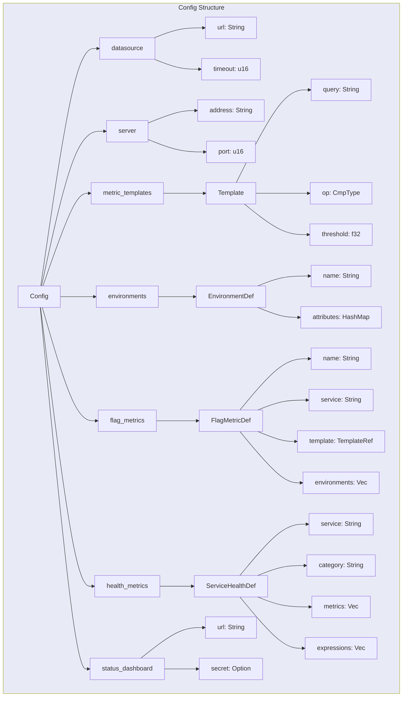

### AppState Structure

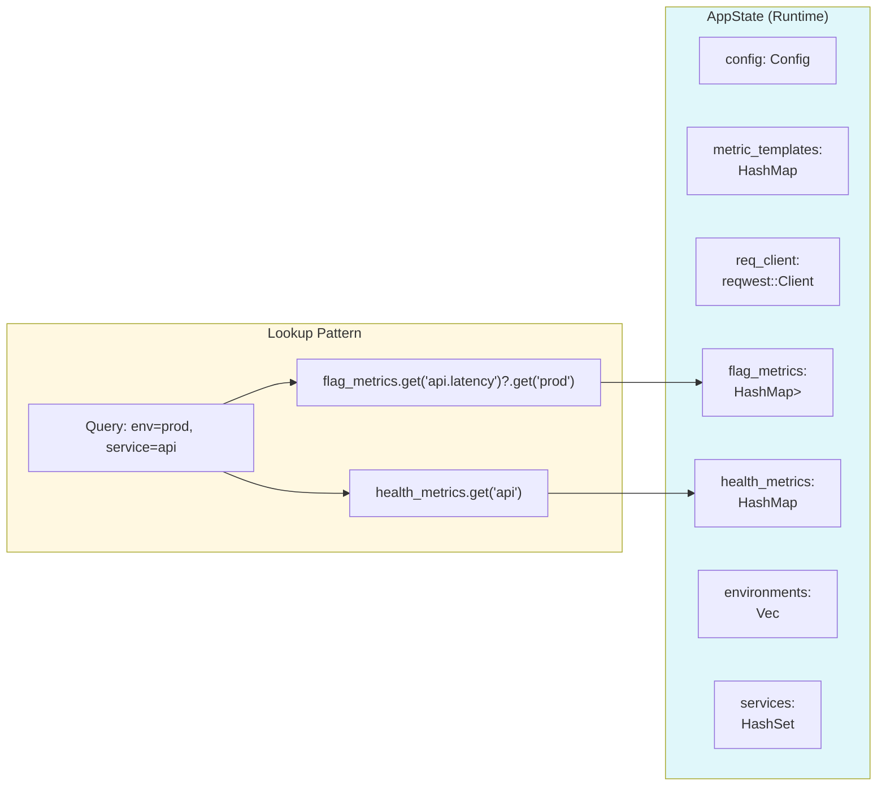

## Error Handling Flow

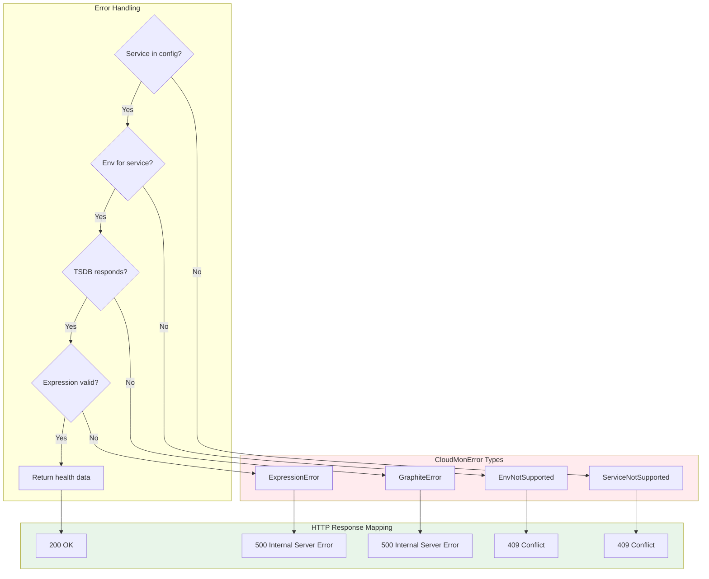

## Related Documentation

- [Architecture Overview](overview.md): Detailed component descriptions
- [Data Flow](data-flow.md): Step-by-step processing documentation
- [API Reference](../api/endpoints.md): HTTP endpoint specifications
