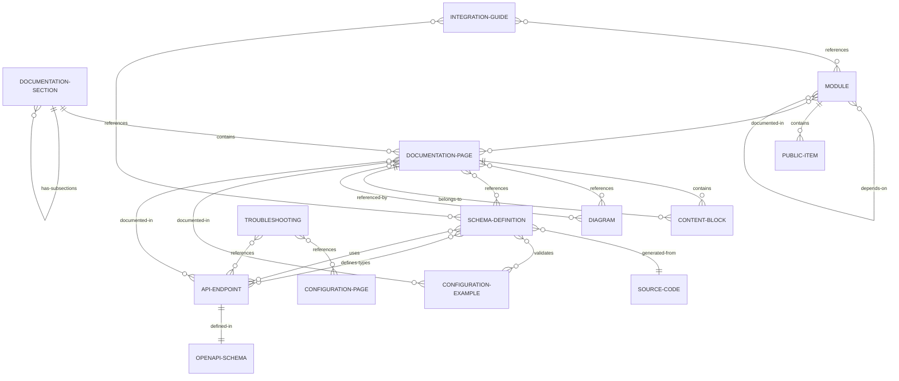
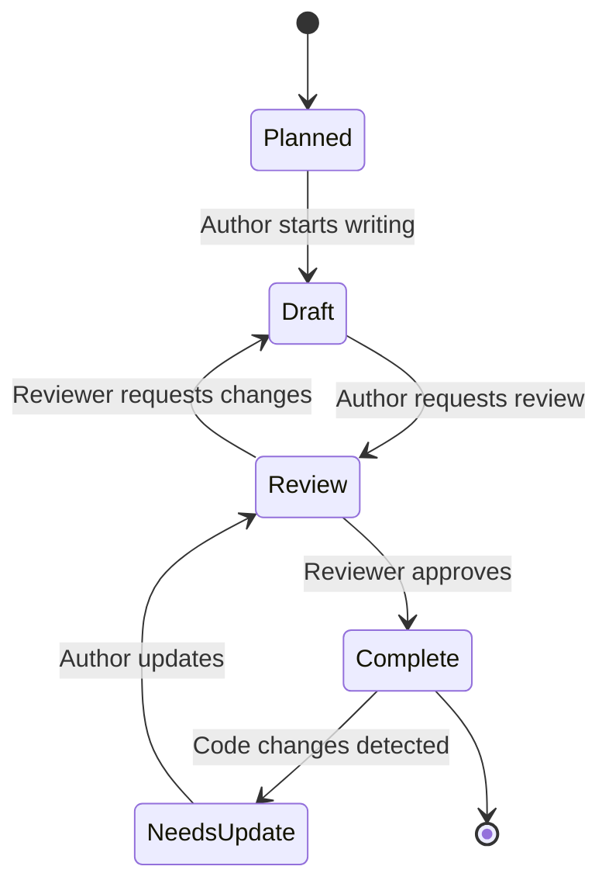

# Data Model: Project Documentation System

**Feature**: 001-project-documentation  
**Date**: 2025-01-23  
**Purpose**: Define the structure and relationships of documentation entities

## Overview

This document defines the logical data model for the comprehensive project documentation system. While documentation is not stored in a traditional database, understanding the entities, their attributes, and relationships helps structure the documentation consistently and enables tooling to process it effectively.

---

## Core Entities

### 1. Documentation Section

**Description**: A top-level category of documentation content (e.g., Architecture, API, Configuration)

**Attributes**:
- `id`: String - Unique identifier (e.g., "architecture", "api-reference")
- `title`: String - Human-readable title (e.g., "Architecture Overview")
- `order`: Integer - Display order in navigation
- `path`: Path - Filesystem location (e.g., "doc/architecture/")
- `summary_entry`: String - Line in SUMMARY.md linking to this section
- `audience`: Enum - Primary audience (Developer, Operator, AI-Tool)
- `status`: Enum - Completeness (Draft, Complete, Needs-Update)

**Relationships**:
- Contains many **Documentation Pages**
- May contain **Subsections** (recursive)

**Validation Rules**:
- `id` must be unique across all sections
- `path` must exist in filesystem
- `order` must be positive integer
- Each section must have at least one page

---

### 2. Documentation Page

**Description**: A single markdown file containing specific documentation content

**Attributes**:
- `id`: String - Unique identifier (e.g., "architecture-overview")
- `title`: String - Page title (extracted from first # heading)
- `file_path`: Path - Filesystem location (e.g., "doc/architecture/overview.md")
- `parent_section`: Reference - Parent Documentation Section
- `frontmatter`: Object - Optional YAML frontmatter metadata
  - `date`: DateTime - Last updated
  - `author`: String
  - `tags`: Array<String>
- `content_blocks`: Array<Content Block> - Parsed markdown content
- `references`: Array<String> - Links to other pages or external resources
- `code_examples`: Array<Code Example> - Embedded code snippets

**Relationships**:
- Belongs to one **Documentation Section**
- Contains many **Content Blocks**
- May reference many **Diagrams**
- May reference many **Schema Definitions**

**Validation Rules**:
- `file_path` must exist and be valid markdown
- First line must be level-1 heading (# Title)
- All internal links must resolve to existing pages
- All code examples must specify language

---

### 3. Content Block

**Description**: A logical unit of content within a page (paragraph, code, diagram, etc.)

**Attributes**:
- `type`: Enum - BlockType (Paragraph, CodeBlock, Diagram, Table, List, Heading)
- `content`: String - Raw content
- `language`: String (optional) - For code blocks (rust, yaml, json, bash)
- `metadata`: Object - Type-specific metadata
  - For code blocks: `testable: boolean`, `example_name: string`
  - For diagrams: `diagram_type: string` (mermaid, graphviz)
- `order`: Integer - Position within page

**Relationships**:
- Belongs to one **Documentation Page**

**Validation Rules**:
- Code blocks must have valid syntax for specified language
- Mermaid diagrams must render without errors
- Tables must have consistent column counts

---

### 4. Diagram

**Description**: Visual representation of system architecture, data flow, or relationships

**Attributes**:
- `id`: String - Unique identifier (e.g., "arch-system-overview")
- `title`: String - Diagram title
- `type`: Enum - DiagramType (Architecture, DataFlow, Sequence, ERD, ComponentDependency)
- `format`: Enum - Format (Mermaid, SVG, PNG)
- `source`: String - Diagram definition (for text-based formats)
- `rendered_path`: Path (optional) - For pre-rendered formats
- `entities`: Array<String> - Key entities/components shown
- `description`: String - Text description for accessibility and AI parsing

**Relationships**:
- Referenced by many **Documentation Pages**
- May be associated with **Architecture Components**

**Validation Rules**:
- Mermaid diagrams must compile successfully
- All entities referenced must exist in codebase or configuration
- Must include text description for accessibility (FR-013)

---

### 5. Schema Definition

**Description**: Machine-readable schema for configuration, API types, or data structures

**Attributes**:
- `id`: String - Unique identifier (e.g., "config-schema")
- `name`: String - Schema name (e.g., "Configuration")
- `format`: Enum - SchemaFormat (JSONSchema, TypeScript, OpenAPI)
- `file_path`: Path - Location of schema file (e.g., "doc/schemas/config-schema.json")
- `source_code_ref`: Path - Rust struct this schema derives from (e.g., "src/config.rs:Config")
- `version`: String - Schema version (e.g., "0.2.0")
- `generated`: Boolean - Whether auto-generated from code
- `validation_rules`: Array<Rule> - Validation constraints

**Relationships**:
- Derived from **Source Code Types**
- Referenced by **Configuration Pages**
- Used by **IDE Tools** (external)

**Validation Rules**:
- Must be valid according to format specification
- If `generated: true`, must match source code structure
- Version must match project version

---

### 6. Configuration Example

**Description**: Working configuration sample demonstrating specific features

**Attributes**:
- `id`: String - Unique identifier (e.g., "basic-setup")
- `title`: String - Example title (e.g., "Basic Multi-Service Setup")
- `description`: String - What this example demonstrates
- `content`: String - Full YAML configuration
- `use_cases`: Array<String> - Scenarios this applies to
- `referenced_sections`: Array<Reference> - Config sections demonstrated
- `validated`: Boolean - Whether example has passed validation tests

**Relationships**:
- References **Schema Definition** for validation
- Documented in **Configuration Pages**

**Validation Rules**:
- Must parse as valid YAML
- Must conform to configuration schema
- Must include all required fields from schema
- Should demonstrate at least one unique feature

---

### 7. API Endpoint Documentation

**Description**: Documentation for a specific HTTP API endpoint

**Attributes**:
- `id`: String - Unique identifier (e.g., "get-v1-health")
- `path`: String - URL path (e.g., "/v1/health")
- `method`: Enum - HTTPMethod (GET, POST, PUT, DELETE)
- `summary`: String - Brief description
- `description`: String - Detailed explanation
- `parameters`: Array<Parameter> - Query/path/header parameters
- `request_body`: Schema Reference (optional)
- `responses`: Object<StatusCode, Response> - Possible responses
- `authentication`: String - Auth requirements (e.g., "JWT token")
- `examples`: Array<Example> - Request/response examples
- `openapi_ref`: String - Reference to OpenAPI schema definition

**Relationships**:
- Defined in **OpenAPI Schema** (openapi-schema.yaml)
- Documented in **API Pages**
- May reference **Schema Definitions** for request/response types

**Validation Rules**:
- Must exist in openapi-schema.yaml (FR-012)
- All parameters must have type and description
- Examples must match schema definitions
- Response schemas must match Rust types

---

### 8. Module Documentation

**Description**: Documentation for a Rust module/crate component

**Attributes**:
- `id`: String - Unique identifier (e.g., "module-api")
- `module_name`: String - Rust module name (e.g., "api", "config")
- `path`: Path - Filesystem location (e.g., "src/api.rs" or "src/api/")
- `purpose`: String - Primary responsibility
- `public_items`: Array<PublicItem> - Exported functions, structs, traits
- `dependencies`: Array<String> - Other modules this depends on
- `used_by`: Array<String> - Modules that depend on this
- `key_types`: Array<Type Reference> - Important data structures
- `rustdoc_coverage`: Integer - Percentage of public items documented

**Relationships**:
- Contains **Public API Items**
- Depends on other **Modules**
- Documented in **Module Pages**

**Validation Rules**:
- Module path must exist in src/
- All public items should have rustdoc comments (warn if <90%)
- Dependencies must form acyclic graph (except for lib.rs)

---

### 9. Integration Guide

**Description**: Documentation for integrating with external systems or extending the project

**Attributes**:
- `id`: String - Unique identifier (e.g., "tsdb-integration")
- `title`: String - Guide title (e.g., "Adding a New TSDB Backend")
- `type`: Enum - GuideType (Integration, Extension, Migration)
- `target_audience`: String - Who this is for (e.g., "Backend developers")
- `prerequisites`: Array<String> - Required knowledge or setup
- `steps`: Array<Step> - Sequential instructions
- `code_templates`: Array<CodeTemplate> - Boilerplate code
- `testing_guidance`: String - How to test the integration
- `estimated_time`: Duration - Expected completion time

**Relationships**:
- References **Module Documentation**
- May reference **Schema Definitions**
- Contains **Code Examples**

**Validation Rules**:
- Steps must be numbered sequentially
- All code templates must be syntactically valid
- Prerequisites must reference existing documentation

---

### 10. Troubleshooting Entry

**Description**: A known issue, error, or problem with resolution steps

**Attributes**:
- `id`: String - Unique identifier (e.g., "error-service-not-found")
- `symptom`: String - What the user observes
- `error_message`: String (optional) - Exact error text
- `cause`: String - Root cause explanation
- `solution`: String - Step-by-step resolution
- `related_config`: Array<String> - Config sections involved
- `related_logs`: Array<String> - Log patterns to look for
- `severity`: Enum - Severity (Critical, High, Medium, Low)

**Relationships**:
- References **Configuration Pages**
- May reference **API Endpoint Documentation**
- May reference **Module Documentation**

**Validation Rules**:
- Must include both cause and solution
- Related config/logs must reference real configuration fields
- Error messages should be searchable

---

## Relationships Diagram



---

## State Transitions

### Documentation Page States



---

## Validation & Integrity Rules

### Cross-Entity Validation

1. **Link Integrity**: All internal references must resolve
   - Documentation page links to other pages
   - Schema references to source code
   - Configuration examples to schema definitions

2. **Schema Alignment**: Generated artifacts must match source
   - JSON schemas match Rust struct definitions
   - OpenAPI docs match API endpoint implementations
   - Configuration examples conform to schema

3. **Example Validation**: All code examples must be executable
   - Rust code blocks compile successfully
   - YAML configuration examples parse correctly
   - API request examples match OpenAPI spec

4. **Completeness**: Required documentation exists
   - Every public module has documentation page
   - Every API endpoint documented in API section
   - Every configuration field has description

---

## Implementation Notes

### Tooling Support

- **mdbook**: Renders Documentation Sections, Pages, and Content Blocks into web documentation
- **schemars**: Generates Schema Definitions from Rust types
- **cargo test**: Validates Code Examples and Configuration Examples
- **mdbook-linkcheck**: Validates link integrity across Documentation Pages
- **build.rs**: Automates Schema Definition generation from source code

### File System Mapping

```
doc/                           → Documentation Section (root)
  architecture/                → Documentation Section
    overview.md                → Documentation Page
      # Heading               → Content Block (Heading)
      Paragraph               → Content Block (Paragraph)
      ```mermaid ... ```      → Content Block (Diagram)
  schemas/                     → Schema Definitions storage
    config-schema.json         → Schema Definition
    patterns.json              → Schema Definition (conventions)
```

---

## Summary

This data model defines 10 core entities organized into 4 logical layers:

1. **Structure Layer**: Documentation Sections and Pages
2. **Content Layer**: Content Blocks, Diagrams, Examples
3. **Schema Layer**: Schema Definitions, API Endpoints
4. **Guidance Layer**: Module Docs, Integration Guides, Troubleshooting

The model supports both human-readable documentation (rendered by mdbook) and machine-readable artifacts (JSON schemas, OpenAPI specs) while maintaining referential integrity through validation rules.
